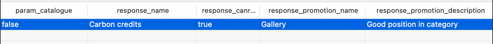
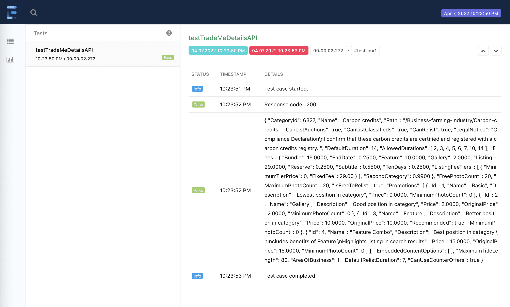
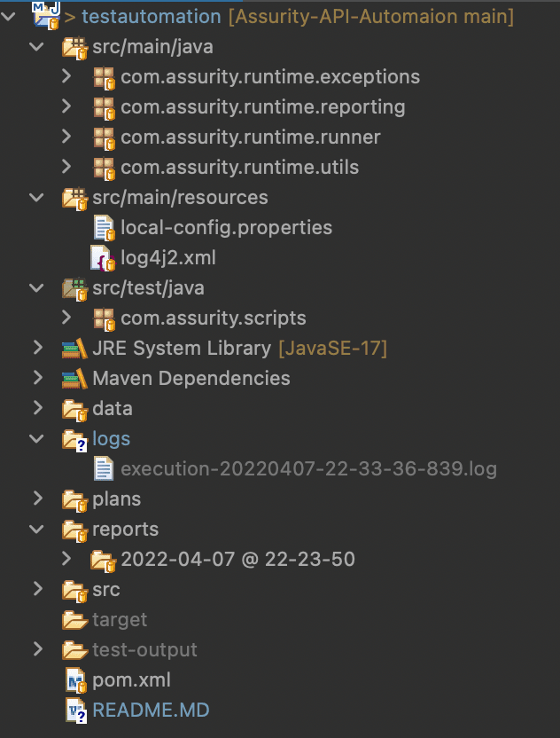
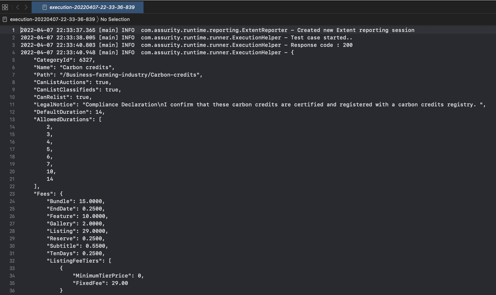
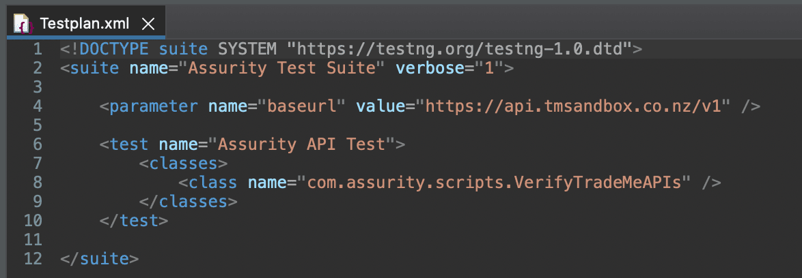

# Assurity API Test Automation

(Author : Chathura Dushmantha)

## Tools and Technologies Used
*	Java 17
*	RestAssured (as the API test tool)
*	TestNG (as test execution engine)
*	Maven (as the build automation tool)
*	Extent Reports (as the reporting engine)
* 	Log4J (as the log manager)

## Developer Setup

### Pre-Requirements 

*	Java JDK 17 (or newer)
*	Eclipse IDE
*	TestNG plugin installed to the IDE 
	* For instructions see official documentation : https://testng.org/doc/download.html


### Developer Setup Steps
*	Clone the project to your local disk
	*	```git clone https://github.com/debugger89/Assurity-API-Automaion.git```
*	Import the project as a Maven project to the IDE.
	*	In Eclipse IDE, use File > Import > Existing Maven Projects and provide the project root folder path


## Project Layout

The project folder contains multiple folders. Following are some of them;

*	src
	*	Contains the source codes for the API testscipts and the runtime module classes.
*	data
	*	Contains the CSV based data files for the test scripts. 
*	logs
	*	Contains the Log4J based log files generated during the test executions.
*	plans
	*	Contains the TestNg test plan XML files
*	reports
	*	Contains the generated test reports through Extent reports during the execution.


## Executing the Test Scripts

### Method 1: Using TestNG Plugin through IDE

The most simple way of executing the test scripts is using the Right-Click > Run method for the test plan XMLs and test classes. 

`Right Click on the test class or XML > Run as > TestNg Test/Suite`


### Method 2: Using Maven Build

For this, you can use Eclipse's built-in Maven or your Maven. 

If running through Eclipse; 

`Right-click on the project or pom.xml > Run As > Maven test`

If using maven through terminal/command prompt, make sure to install maven first. (https://maven.apache.org/install.html)

And run command
```mvn clean test```

This will invoke the test plan XML to be executed as a part of the project's build process. 

## Managing Test Data
Test data files are stored in the data/ folder in project root in CSV format. 

The first row of the CSV is assumed as the column header row and will be ignored. 



The CSV file is linked to the test case through the @DataProvider method. 

```
@DataProvider(name = "dp_testTradeMeDetailsAPI")
public Object[][] dpTestTradeMeDetailsAPI() {

	CSVTestDataParser parser = new CSVTestDataParser();
	// Read and convert the specific CSV file for the test
	return parser.readCSVDataFromFile("data" + File.separator + "TestTradeMeDetailsAPI.csv");
}
```
If changing the CSV file is needed, change only in the DataProvider method to provide the new CSV relative file path.

## Managing BaseURL
In a scenario where a user is required to run the same test plan for a different environment, they can use the externalized test plan parameter 'baseurl' to provide the new environment base URL path. So there will not be any code-level changes.

```
<parameter name="baseurl" value="https://api.tmsandbox.co.nz/v1" />
```

Full example XML: 

```
<!DOCTYPE suite SYSTEM "https://testng.org/testng-1.0.dtd">
<suite name="Assurity Test Suite" verbose="1">

	<parameter name="baseurl" value="https://api.tmsandbox.co.nz/v1" />

	<test name="Assurity API Test">
		<classes>
			<class name="com.assurity.scripts.VerifyTradeMeAPIs" />
		</classes>
	</test>

</suite>
```

If the execution is not done thorough a test plan (right click and run on a test class), the baseurl value will be picked up from the `local-config.properties` file in the src/main/resources folder.


## Screenshots

#### Reports : 



#### Project Layout : 


#### CSV Test Data : 


#### Log4J Logs : 


#### Test plan : 
